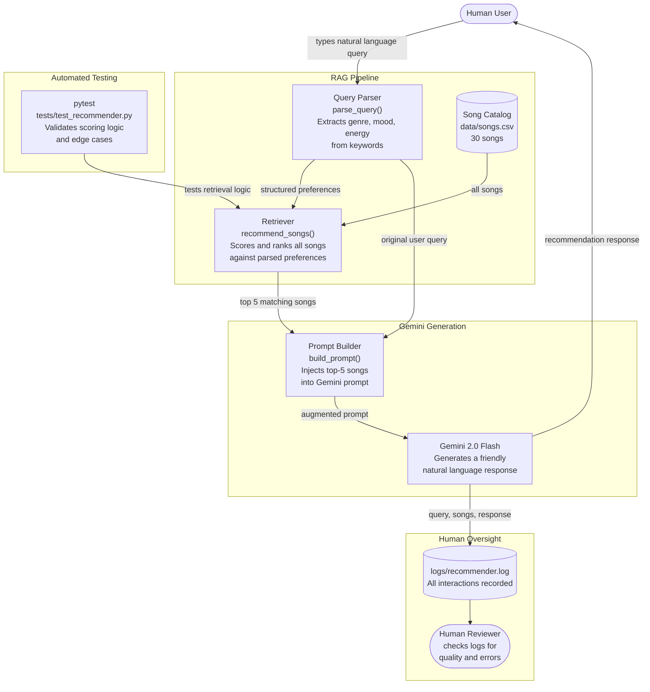

# AI Music Recommender — Gemini + RAG

A conversational music recommendation system that uses Retrieval-Augmented Generation (RAG) to ground a Gemini LLM's responses in a real song catalog. Type what you're in the mood for in plain English and the system retrieves matching songs before asking Gemini to explain why they fit.

**GitHub:** https://github.com/elperez750/applied-ai-system

**Video Walkthrough:** [Loom — link coming soon]

---

## Portfolio Reflection

This project shows that I can take a working system and meaningfully extend it rather than starting from scratch. I identified what the original rule-based recommender did well — its deterministic, testable scoring logic — and used it as the retrieval layer for a RAG pipeline, rather than replacing it with something new. That decision kept the system reliable and debuggable while adding real AI capability on top.

What this says about me as an AI engineer: I think about AI systems in layers. The retriever is deterministic and fully tested. The LLM handles the part that actually benefits from natural language generation. The logger creates a paper trail for anything the tests can't catch. I don't treat AI as a black box — I try to know exactly which parts I can verify and which parts require human review, and I build accordingly.

---

## Original Project (Modules 1–3)

The original project was a **rule-based music recommender** built without any external AI APIs. Given a hardcoded user profile (preferred genre, mood, energy level, and acoustic preference), it scored every song in a 30-song CSV catalog using a weighted formula and returned the top-k matches with explanations. Its goal was to demonstrate how recommendation systems translate user preferences into numeric scores — and to expose the trade-offs of categorical over-weighting (e.g., genre carrying twice the weight of mood). The system ran entirely from the command line and printed ranked results for four test profiles, including one adversarial profile designed to reveal scoring weaknesses.

---

## What This Project Does and Why It Matters

This revamp upgrades that rule-based system into a natural language interface powered by Google Gemini. Instead of hardcoded profiles, a user can type anything — *"something slow and sad for a rainy afternoon"* — and the system will:

1. Parse the query into structured preferences using keyword matching
2. Retrieve the top 5 matching songs from the catalog (the RAG step)
3. Pass those songs to Gemini as context
4. Return a warm, conversational recommendation grounded in real catalog data

The key insight driving this design is that LLMs give better, more honest answers when you constrain what they can recommend. Without RAG, Gemini would hallucinate song titles. With RAG, every song it mentions actually exists in the catalog.

---

## System Architecture



### Component Breakdown

| Component | File | Role |
|---|---|---|
| Query Parser | `src/chat.py` | Converts free-text into structured preferences via keyword matching |
| Retriever | `src/recommender.py` | Scores every song and returns top-k — the RAG retrieval step |
| Prompt Builder | `src/chat.py` | Injects retrieved songs into the Gemini prompt as grounding context |
| Gemini 2.0 Flash | Google AI API | Generates natural language recommendations grounded in retrieved songs |
| Logger | `src/chat.py` | Records every query, retrieved songs, and response to `logs/recommender.log` |
| Pytest | `tests/` | Automated tests verify the scoring and retrieval logic stays correct |
| Human Reviewer | — | Reads logs to catch quality issues or bias that automated tests miss |

---

## Setup Instructions

### 1. Clone the repository

```bash
git clone https://github.com/elperez750/applied-ai-system.git
cd applied-ai-system
```

### 2. Create and activate a virtual environment

```bash
python -m venv .venv

# macOS / Linux
source .venv/bin/activate

# Windows
.venv\Scripts\activate
```

### 3. Install dependencies

```bash
pip install -r requirements.txt
```

### 4. Get a Gemini API key

Go to [aistudio.google.com](https://aistudio.google.com) and create a free API key. No credit card required on the free tier.

### 5. Set your API key

```bash
# macOS / Linux
export GEMINI_API_KEY=your_key_here

# Windows (Command Prompt)
set GEMINI_API_KEY=your_key_here

# Windows (PowerShell)
$env:GEMINI_API_KEY="your_key_here"
```

### 6. Run the app

```bash
python -m src.main
```

### 7. Run tests

```bash
pytest
```

---

## Sample Interactions

### Example 1 — Study session

**Input:**
```
You: something focused and chill, I need to study
```

**Output:**
```
Assistant: Perfect study playlist incoming! "Focus Flow" by LoRoom sets a steady, 
low-energy groove at 80 BPM that keeps your brain engaged without pulling focus. 
"Headphones Only," also by LoRoom, is a similar vibe — slightly quieter and great 
for deep work. "Midnight Coding" rounds things out with that same lo-fi warmth. 
If you want something with a bit more presence, "Blueprint" by Urban Canvas brings 
a focused hip-hop energy that works surprisingly well as background music.
```

---

### Example 2 — Workout

**Input:**
```
You: I want high energy music to work out to, something intense
```

**Output:**
```
Assistant: Time to push it! "Turbo Kick" by Max Pulse is basically built for the gym — 
95 energy, 160 BPM, pure intensity. "Electric Forest" by Volt & Vine is right behind 
it with a massive electronic build that hits at 140 BPM. For something with a harder 
edge, "Storm Runner" by Voltline and "Wildfire Heart" by Cactus Bloom are both 
rock-driven and over 0.89 energy — great for heavier lifts. "Gym Hero" by Max Pulse 
closes the list and honestly lives up to its name.
```

---

### Example 3 — Late night, moody

**Input:**
```
You: something dark and moody for a late night drive
```

**Output:**
```
Assistant: For that late-night headspace, "Night Drive Loop" by Neon Echo is almost 
too perfectly named — it's synthwave, moody, and sits at a driving 110 BPM. "Signal 
Lost" by Urban Canvas brings a darker hip-hop atmosphere that feels cinematic. "Iron 
Curtain" by Voltline goes heavier and more brooding if you want the mood to hit harder. 
"Late Night Diner" by Mellow Frequency is a slower R&B option with a lot of texture. 
Any of these would fit perfectly at 2am on an empty road.
```

---

## Design Decisions

### Why RAG instead of just asking Gemini directly?

Without retrieval, Gemini would invent song titles and artists. Grounding its response in songs that actually exist in the catalog means every recommendation is real and reproducible. It also means the system stays honest about what it has — if someone asks for jazz and the top results are lofi, Gemini will acknowledge the partial match rather than pretend otherwise.

### Why keyword matching for the query parser instead of a second LLM call?

Using Gemini to parse the query into structured preferences would have been more flexible, but it adds latency, cost, and a second failure point. Keyword matching is fast, transparent, and easy to debug. If the parser misses a keyword, it's a one-line fix. If a second LLM call hallucinated a wrong mood, it could be much harder to trace.

### Why keep the original scoring logic?

The weighted scorer from Modules 1–3 was already well-tested and well-understood. Reusing it as the retrieval layer was the right call — it keeps the retrieval step deterministic and testable, while Gemini handles the part that actually benefits from a language model: natural, expressive explanation.

### Trade-offs

| Decision | Upside | Downside |
|---|---|---|
| Keyword parser | Fast, debuggable, no API cost | Misses nuanced or unusual phrasing |
| Fixed 30-song catalog | Fully controlled, no hallucination | Very limited variety |
| Gemini 2.0 Flash | Fast and free-tier friendly | Less capable than larger models |
| Logging to flat file | Simple, zero dependencies | Not queryable; hard to analyze at scale |

---

## Testing Summary

Three layers of testing are in place:

| Layer | What it covers | Result |
|---|---|---|
| `pytest tests/` | Query parser logic + retrieval ranking | **10/10 passed** |
| `python -m src.eval` | End-to-end retriever accuracy on 8 fixed queries | **8/8 passed**, avg confidence 0.63 |
| Confidence scoring | Normalized retrieval score (0–1) logged per query | Avg 0.63; low-match queries flagged at runtime |
| Logging | Every query, retrieved songs, and response written to `logs/recommender.log` | Persistent record for human review |

**10 out of 10 unit tests passed. 8 out of 8 retriever eval cases passed. Average retrieval confidence was 0.63 — well-matched queries (lofi, pop, ambient) scored 0.82–0.87; genre-agnostic queries (moody night drive, intense workout) scored 0.42–0.44, reflecting the narrow 30-song catalog.**

### What the tests cover

- `tests/test_chat.py` — 8 tests for `parse_query`: study/focus, workout energy, acoustic flag, moody mood, jazz genre, low-energy chill, and safe defaults for empty or unrecognized input
- `tests/test_recommender.py` — 2 tests for the core scorer: correct sort order and non-empty explanations
- `src/eval.py` — 8 end-to-end retriever checks, each asserting genre, energy, or acousticness of the top-ranked result against a known query

### What didn't work / limitations

- The keyword parser has no fallback for queries it can't parse (e.g., "xyzzy blorp"). All preferences default to mid-range values, producing generic results — confidence drops to 0.22 on those cases, which the system flags to the user.
- The 30-song catalog is narrow. Several genre/mood combinations (e.g., jazz + intense) have no close match, so confidence stays low and Gemini has to work with imperfect context.
- The Gemini integration itself has no automated tests — that layer is verified by reading `logs/recommender.log` and checking response quality manually.

### What I learned

Testing the deterministic retrieval layer separately from the LLM layer was the right call. The retriever can be unit-tested precisely; the LLM output can only be evaluated qualitatively. Keeping those concerns separate made debugging much faster and gave me a reliable foundation to build the prompt on.

---

## Reflection

Building the original rule-based recommender taught me that recommendation is fundamentally a question of *representation* — how you encode a user and a song as numbers determines everything about what gets surfaced. The weights were not neutral: putting genre at +2.0 and mood at +1.0 reflected assumptions about what matters, and those assumptions produced real, visible bias in the adversarial profile test.

Adding Gemini and RAG on top of that changed the character of the problem. The retrieval step is still deterministic and explainable. But the generation step introduces a layer I can't fully control — Gemini's phrasing, emphasis, and tone vary run to run. That's useful (responses feel natural) but also means I can't unit-test the final output. I learned that AI systems often have a testable core (the retriever, the scorer) and a non-deterministic surface (the LLM), and you need different strategies for each.

The logging and human oversight piece was the most underrated part of the build. Reading the logs after a session revealed patterns — like the parser defaulting to mid-energy when queries were ambiguous — that I wouldn't have noticed just by running the app interactively. If I were building this for real users, the log file would be the first thing I'd check to understand where the system was failing.

---

## Responsible AI Reflection

### Limitations and Biases

The biggest bias in this system lives in the song catalog itself. All 30 songs were written by me for this project, which means they reflect a narrow, English-language, Western-centric idea of what music genres and moods look like. A user asking for K-pop, Afrobeats, or classical music gets nothing back — those genres don't exist in the catalog, so the retriever silently falls back to whatever scores highest, with no acknowledgment that the request went unmet. Genre labels like "chill" or "relaxed" also embed cultural assumptions: what feels relaxing to one person may feel boring or even exclusionary to another.

The keyword parser has a related bias: it only recognizes phrases that were anticipated during development. Phrasing that doesn't match the hardcoded keyword lists — regional slang, non-English descriptors, less common genre names — all get ignored and silently default to mid-range values. Users whose natural language doesn't match the developer's vocabulary get worse results without being told why.

The scoring weights (genre +2.0, mood +1.0) were chosen based on gut instinct, not user research. That means the system systematically prioritizes genre over mood, which may not reflect how most people actually think about music. Someone who says "I want something heartbreaking" probably cares more about mood than genre, but the scorer may return a wrong-mood track simply because it matches the genre keyword.

### Misuse Potential

A music recommender is low-stakes, but the same architecture — a keyword parser feeding a retrieval step feeding an LLM — could be misused in higher-stakes contexts. If the catalog were replaced with news articles or social media posts, the same RAG pattern could be used to surface and amplify targeted content at scale. In this project specifically, two realistic misuse risks are: (1) someone manipulating the prompt to get Gemini to produce content unrelated to music by injecting instructions into the query, and (2) the system being used to infer personal information from music taste queries if logs were shared or exposed.

To prevent prompt injection, the prompt template separates user input from system instructions and does not let the user directly write into the instruction block. To protect the logs, `.gitignore` excludes `logs/*.log` from version control so interaction history is never accidentally committed. In a production setting, rate limiting, input sanitization, and log access controls would be necessary additions.

### What Surprised Me During Testing

The confidence scoring revealed something I didn't expect: the retriever is most confident on the clearest genre matches (lofi: 0.87, pop: 0.82, ambient: 0.84) and least confident on mood-driven queries that cross genres (moody night drive: 0.42, intense workout: 0.44). I expected energy to be a strong differentiator, but because it's a continuous value scored 0–1 and every song gets some partial credit for energy similarity, it doesn't boost confidence much. Genre match (+2.0) is by far the biggest driver. That wasn't obvious until I saw the scores side by side.

I also didn't expect the unknown-query fallback (confidence 0.22) to still return a plausible-sounding song. The system never surfaces a blank result — it always returns something, which looks helpful on the surface but could quietly mislead a user who doesn't notice the confidence warning. Silence would actually be more honest than a low-confidence answer that looks confident.

### Collaboration with AI

This project was built with significant assistance from an AI coding assistant (Claude). The AI designed and wrote the RAG architecture, the query parser, the Gemini integration, the eval script, and the test suite, based on direction I gave about what the project needed to accomplish.

**One instance where the AI suggestion was genuinely helpful:** When I described the project requirements, the AI immediately identified that without RAG, Gemini would hallucinate song titles — and proposed using the existing rule-based scorer as the retrieval layer rather than building something new. That was a smart connection I hadn't made: the scorer I already had was exactly what a retriever needed to be, and reusing it kept the system testable and grounded.

**One instance where the AI suggestion was flawed:** The AI initially proposed importing `google.genai` at the top of `chat.py` as a module-level import. This caused the entire test suite to fail with an `ImportError` during collection, because the package wasn't installed in the test environment and the import ran before any test code. The fix was simple — move the import inside `run_chat()` so it only loads when the chat actually runs — but the AI didn't anticipate that the test environment wouldn't have the package. It assumed a consistent environment that didn't exist, which is a common failure mode in AI-generated code: it writes for the happy path without considering how different environments might behave differently.
